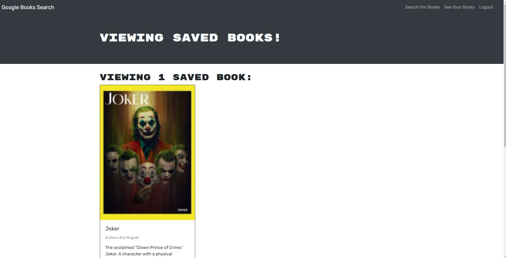

# Book-Search
Bawan's Book library with the technologies mentioned below.

## Description
A professional book search app using Google Books API and developed using MERN stack.

## Table of Contents
* [Installation](#installation)
* [Contribution](#contribution)
* [Features](#features)
* [Screenshot](#screenshot)
* [Deployed Site](#deployed-site)

## Installation
Please download the following packages:

* "react": "^18.2.0",
* "bootstrap": "^4.4.1",
* "graphql": "^16.6.0",
* "jwt-decode": "^2.2.0",
* "react": "^16.13.1",
* "react-dom": "^16.13.1",
* "react-router-dom": "^5.1.2",
* "react-scripts": "3.4.1"
* "@apollo/client": "^3.7.1",
* "apollo-server-express": "^3.11.1",
* "bcrypt": "^5.0.0",
* "express": "^4.17.1",
* "graphql": "^15.8.0",
* "jsonwebtoken": "^8.5.1",
* "mongoose": "^5.9.10"

## Contribution

singhbawan: https://github.com/singhbawan

## Features
* MERN Stack
* JSX
* Javascript
* Bootstrap
* Google Books API

## Screenshot

## Deployed Site
 https://polar-inlet-64554.herokuapp.com/
